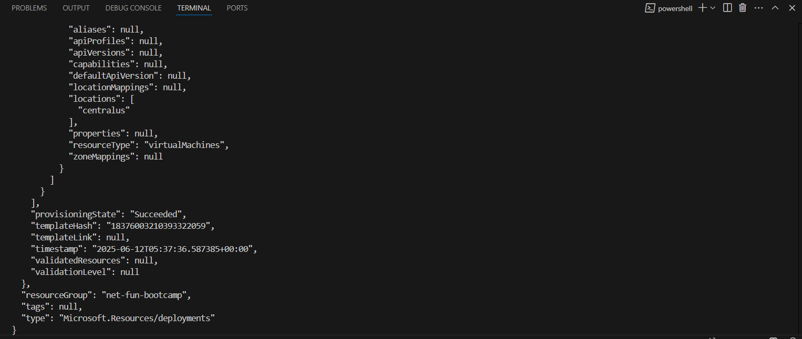

## Downloaded Azure Resource Template

After deploying my Microsoft Windows Server 2025 to Azure VM.
I downloaded the Resource Templates to be able to easily deploy again.

## Converting Resource Template to Azure Bicep

I launched the Windows Server that has UI.
I want to reuse my resource template files, but they are too hard to 
work with directly. So I am going to convert them to Azure Bicep.

```sh
cd ip-address-management/templates/vm
az bicep decompile --file template.json
```

## Running Deployment command in powershell

If I run command 
```sh
az deployment group create --resource-group net-fun-bootcamp --template-file ./template.bicep --parameters "@parameters.json"
```
with out creating resource group first, I get error "The content for this response was already consumed". I looked into ChatGPT and it suggested to create resource group first separately and then run the deployment command.


I first created a resource group using az group create command.
Then I made sure whether resource is created using az resource list command.
After that, I ran az deployment group create command to deploy the virtual machine. It successfully craeted the virtual machine on Azure
```sh
az group create --name net-fun-bootcamp --location centralus
az resource list --resource-group net-fun-bootcamp --output table
az deployment group create --resource-group net-fun-bootcamp --template-file ./template.bicep --parameters "@parameters.json"
```

Here is the success message screenshot.


