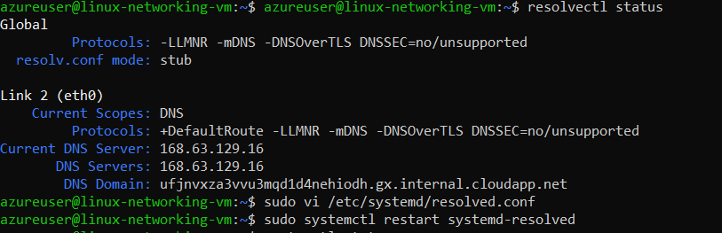
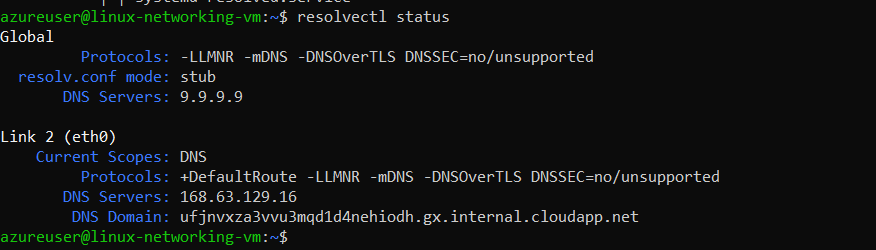
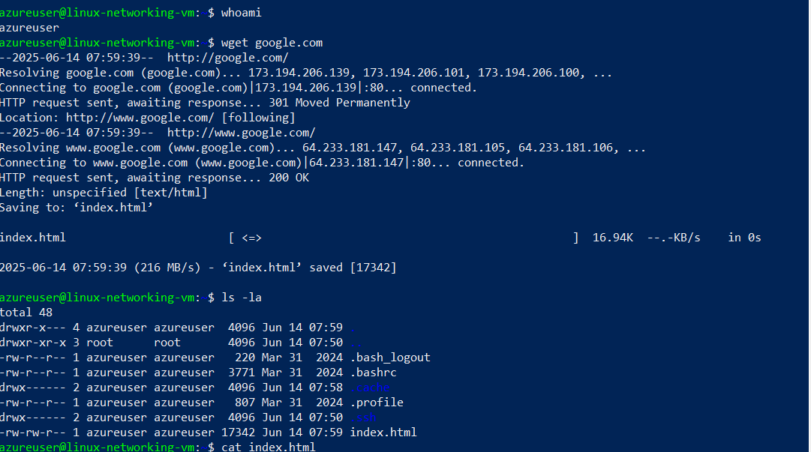
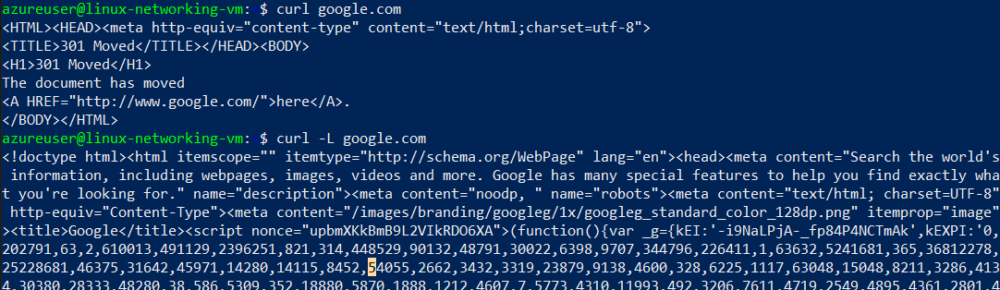

## Resolver




## Wget vs Curl

Wget is a command to fetch html page content of http or https url. It automatically redirects to correct url If the page
is moved to new url. It also save the html contect of fetched url into a newly created index.html file.
Curl is a command to fetch html page content of http or https url but it just displays html content on the console.
It does not save the html content into a file. It does automatically redirect to new url if the old url is moved to
new url.


Wget Command
```sh
wget google.com
```




Basic Curl Command
```sh
curl google.com
```

Automatic Redirect Curl Command
```sh
curl -L google.com
```

