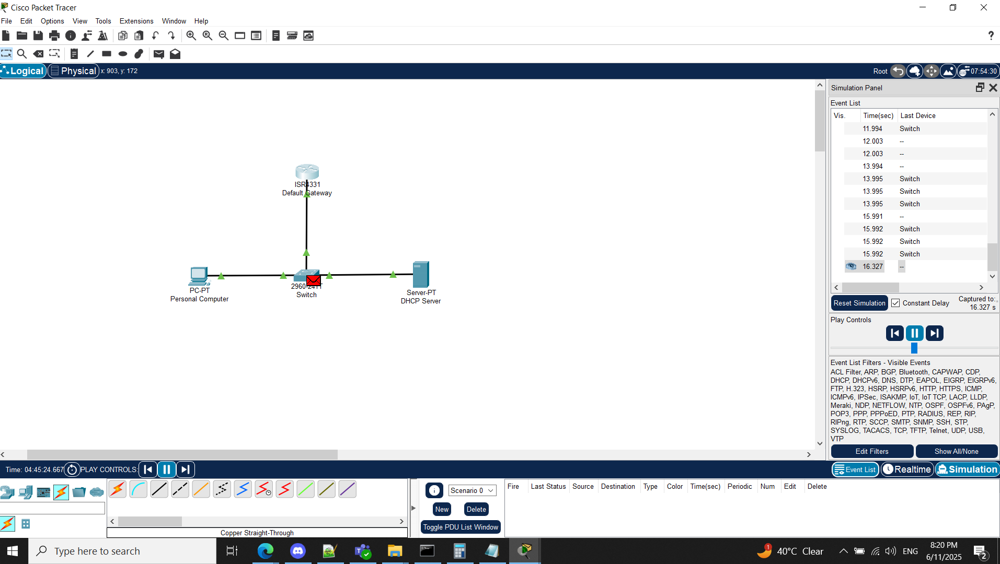

# State of the Network

While exploring Packet Tracer I simulated a network that shows the interconnectedness between a personal computer, a switch, a router aka Default Gateway and a server machine that acts as DHCP server.

In the image, there is diagram made on Cisco Packet Tracer software. There is a router 4331 displayed as "Default Gateway" that acts as a point to connect to other networks be it internet, Cloud network or an on-premise network. THe Default Gateway is given a static/manual IP address 192.168.0.1 /24 with Subnet Mask 255.255.255.0. It means this subnet can contain 256 devices. I assigned first usable IP 192.168.0.1 to router/Default Gateway. Router also runs DNS service. So DNS service also runs at 192.168.0.1. Router uses GigabitEthernet0/0/0 interface at its end and connects to a Switch having interface GigabitEthernet0/1. 

Switch is used to communicate with devices in the subnet or in the local network. Switch is also connected to a personal computer which is not assigned a static/manual IP address and it relies on DHCP server to give it an IP address. Switch is also connected to a server machine that acts as DHCP server. DHCP server is assigned a static/manual IP address because if DHCP server itself relies on another DHCP server to assign it a new IP, and in the network we dont have any other DHCP server, the logic won't work. 

When system gets activated, personal computer sends a broadcast message "Hey DHCP, Can you give me an IP address?". DHCP server replies to that message using DORA (Discover, Offer, Reply, Acknowledgment). IP address is assigned to personal computer and all devices in the network know using gratitous ARP message about IP address of personal computer.