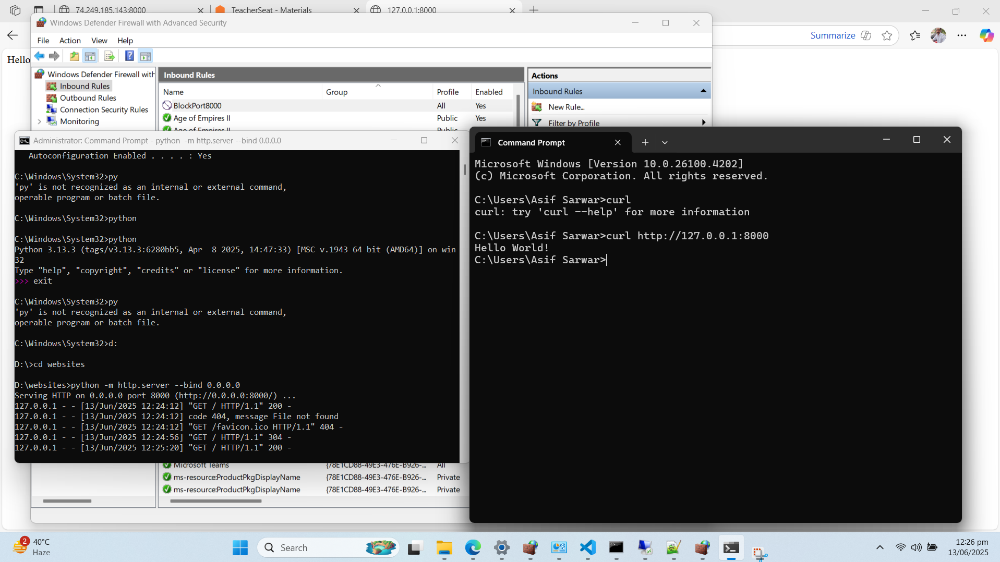
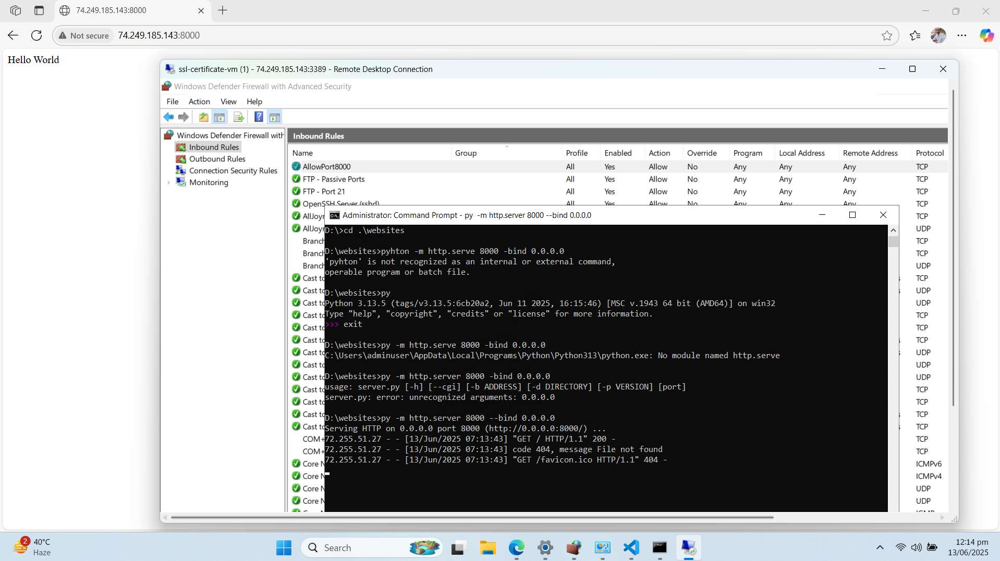

## Firewall Rules Testing Locally

When attempting to test Firewalls locally, we determine
its hard to test when you are using localhost because
Firewalls rules will not block on the same network
so we need to attempt to access the network on different
machine.

## Azure Windows Server, Serving Simple Website

We were able to start a web server using python to serve
a single static page.

