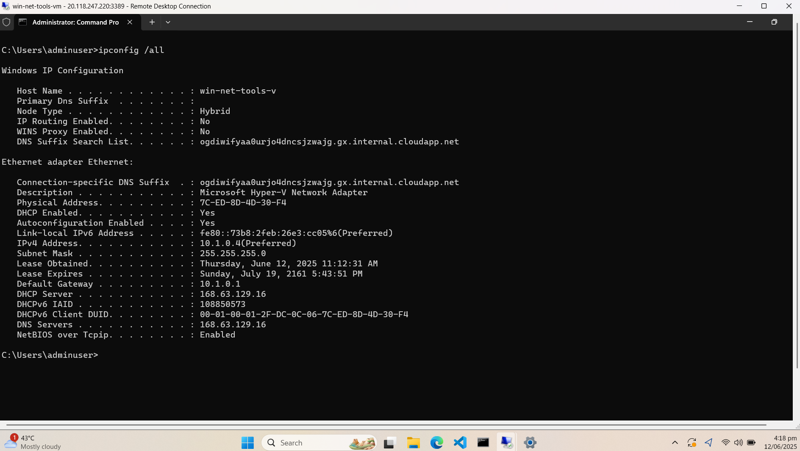

## Developer Environment



I am working on Azure Virtual Machine. This is a cloud environment because as you can see in above screenshot, 
the DHCP server IP address is 168.63.129.16 which is what Azure uses for its DHCP server. The Default Gateway
is 10.1.0.1 usually used by Azure. The description of 
Ethernet Adpapter is "Microsoft Hyper-5 Network Adapter" which is the adapter name used by Azure.

## IPConfig

```text
ipconfig /all

Windows IP Configuration

   Host Name . . . . . . . . . . . . : win-net-tools-v
   Primary Dns Suffix  . . . . . . . :
   Node Type . . . . . . . . . . . . : Hybrid
   IP Routing Enabled. . . . . . . . : No
   WINS Proxy Enabled. . . . . . . . : No
   DNS Suffix Search List. . . . . . : ogdiwifyaa0urjo4dncsjzwajg.gx.internal.cloudapp.net

Ethernet adapter Ethernet:

   Connection-specific DNS Suffix  . : ogdiwifyaa0urjo4dncsjzwajg.gx.internal.cloudapp.net
   Description . . . . . . . . . . . : Microsoft Hyper-V Network Adapter
   Physical Address. . . . . . . . . : 7C-ED-8D-4D-30-F4
   DHCP Enabled. . . . . . . . . . . : Yes
   Autoconfiguration Enabled . . . . : Yes
   Link-local IPv6 Address . . . . . : fe80::73b8:2feb:26e3:cc05%6(Preferred)
   IPv4 Address. . . . . . . . . . . : 10.1.0.4(Preferred)
   Subnet Mask . . . . . . . . . . . : 255.255.255.0
   Lease Obtained. . . . . . . . . . : Thursday, June 12, 2025 11:12:31 AM
   Lease Expires . . . . . . . . . . : Sunday, July 19, 2161 5:43:51 PM
   Default Gateway . . . . . . . . . : 10.1.0.1
   DHCP Server . . . . . . . . . . . : 168.63.129.16
   DHCPv6 IAID . . . . . . . . . . . : 108850573
   DHCPv6 Client DUID. . . . . . . . : 00-01-00-01-2F-DC-0C-06-7C-ED-8D-4D-30-F4
   DNS Servers . . . . . . . . . . . : 168.63.129.16
   NetBIOS over Tcpip. . . . . . . . : Enabled
```

The command ipconfig /all result shows all the Network Interface Cards associated with this machine and their settings like IP address, Subnet Mask, Default Gateway, DHCP Server, DNS Server etc

## Ping

```text
ping www.exampro.co

Pinging www.exampro.co [3.169.149.120] with 32 bytes of data:
Reply from 3.169.149.120: bytes=32 time=13ms TTL=243
Reply from 3.169.149.120: bytes=32 time=12ms TTL=243
Reply from 3.169.149.120: bytes=32 time=12ms TTL=243
Reply from 3.169.149.120: bytes=32 time=13ms TTL=243

Ping statistics for 3.169.149.120:
    Packets: Sent = 4, Received = 4, Lost = 0 (0% loss),
Approximate round trip times in milli-seconds:
    Minimum = 12ms, Maximum = 13ms, Average = 12ms
```

The command ping www.exampro.co tries to connect to machine whose domain name is www.exampro.co by sending packets and waiting to see if get its response back of each packet it sent whether from the www.exampro.co server or intermediate routers.

## Tracert

```text
tracert www.exampro.co

Tracing route to www.exampro.co [108.156.211.83]
over a maximum of 30 hops:

  1     *        *        *     Request timed out.
  2     *        *        *     Request timed out.
  3     *        *        *     Request timed out.
  4     *        *        *     Request timed out.
  5     *        *        *     Request timed out.
  6     *        *        *     Request timed out.
  7     *        *        *     Request timed out.
  8     *        *        *     Request timed out.
  9     *        *        *     Request timed out.
 10     *        *        *     Request timed out.
 11     *        *        *     Request timed out.
 12     *        *        *     Request timed out.
 13     *        *        *     Request timed out.
 14     *        *        *     Request timed out.
 15     *        *        *     Request timed out.
 16     *        *        *     Request timed out.
 17    15 ms    15 ms    15 ms  server-108-156-211-83.dfw56.r.cloudfront.net [108.156.211.83]

Trace complete.
```

This command tracert is used to get the path/route taken by packet to reach the destination. It shows the intermediate hops/routers that packet passes through. The Request timed out means router could not reply back to the sender.

## Netstat

```text
netstat

Active Connections

  Proto  Local Address          Foreign Address        State
  TCP    10.1.0.4:22            172.58.182.198:41810   ESTABLISHED
  TCP    10.1.0.4:3389          72.255.51.27:12047     ESTABLISHED
  TCP    10.1.0.4:49764         168.63.129.16:32526    ESTABLISHED
  TCP    10.1.0.4:49771         168.63.129.16:http     ESTABLISHED
  TCP    10.1.0.4:49785         20.59.87.226:https     ESTABLISHED
  TCP    10.1.0.4:49800         168.63.129.16:32526    ESTABLISHED
  TCP    10.1.0.4:49841         20.59.87.226:https     ESTABLISHED
  TCP    10.1.0.4:53887         168.63.129.16:http     ESTABLISHED
```

This command netstat shows the active connections made by programs on this machine to what ever other networks. It shows source IP/Port and destination IP/Port along with the communication protocol like TCP, UDP etc

## Route

```text
route print
===========================================================================
Interface List
  6...7c ed 8d 4d 30 f4 ......Microsoft Hyper-V Network Adapter
  1...........................Software Loopback Interface 1
===========================================================================

IPv4 Route Table
===========================================================================
Active Routes:
Network Destination        Netmask          Gateway       Interface  Metric
          0.0.0.0          0.0.0.0         10.1.0.1         10.1.0.4     11
         10.1.0.0    255.255.255.0         On-link          10.1.0.4    266
         10.1.0.4  255.255.255.255         On-link          10.1.0.4    266
       10.1.0.255  255.255.255.255         On-link          10.1.0.4    266
        127.0.0.0        255.0.0.0         On-link         127.0.0.1    331
        127.0.0.1  255.255.255.255         On-link         127.0.0.1    331
  127.255.255.255  255.255.255.255         On-link         127.0.0.1    331
    168.63.129.16  255.255.255.255         10.1.0.1         10.1.0.4     11
  169.254.169.254  255.255.255.255         10.1.0.1         10.1.0.4     11
        224.0.0.0        240.0.0.0         On-link         127.0.0.1    331
        224.0.0.0        240.0.0.0         On-link          10.1.0.4    266
  255.255.255.255  255.255.255.255         On-link         127.0.0.1    331
  255.255.255.255  255.255.255.255         On-link          10.1.0.4    266
===========================================================================
Persistent Routes:
  None

IPv6 Route Table
===========================================================================
Active Routes:
 If Metric Network Destination      Gateway
  1    331 ::1/128                  On-link
  6    266 fe80::/64                On-link
  6    266 fe80::73b8:2feb:26e3:cc05/128
                                    On-link
  1    331 ff00::/8                 On-link
  6    266 ff00::/8                 On-link
===========================================================================
Persistent Routes:
  None
```

The command route PRINT shows the routing table that contains information about which route is configured with which NIC.